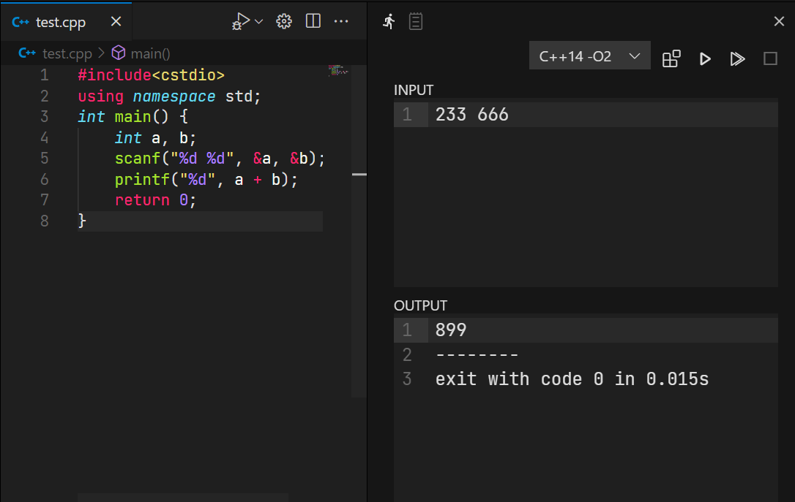

# OI Runner
专为OIer和ACMer设计的VSCode插件，用于运行竞赛单文件代码。


## 特性
- 快速运行单文件代码
- 重定向标准输入输出，分离显示（类洛谷在线IDE）
- 在VSCode中切换不同代码文件时，对每个文件单独保存现场，无痛在不同题目之间反复横跳
- 理论上支持任何语言，配置相对自由（大概）
- 自适应布局，可以放在屏幕底部或左右侧，自动调整布局
- 自动适应编辑器的深色/浅色主题，不会瞎眼

## 环境要求
需要你的电脑上有想要使用的语言的编译器/解释器，最好包含在PATH环境变量中。

## 使用说明
下拉框选择要使用的语言选项，按钮从左到右分别为编译、运行、编译并运行、停止（DevCpp经典）。

## 插件配置
### `oi-runner.commands`

`oi-runner.commands` 配置项指定了选择不同语言选项时，要执行的不同命令。

```json
"oi-runner.commands": {
  "C++11 -O2": [
    // g++ test.cpp -otest -std=c++11 -O2 -Wall
    ["g++", ["[file]", "-o[file-]", "-std=c++11", "-O2", "-Wall"]],
    // 运行产物 test.exe
    ["[file-].exe", []]
  ],
  "python": [
    ["",[]], // Python不需要编译，留空即可
    ["python", ["[file]"]] // python test.py
  ],
  "语言选项的名称": [
    ["程序名称，如编译器", ["选项1", "选项2", "选项3"]], // 编译指令
    ["程序名称，如编译产物", []] // 运行指令
  ]
}
```
**重要提示**：双斜杠开头的注释在json中**不合法**，这里是为了说明方便才写的。请在配置时**去掉**双斜杠开头的“注释”！

语言选项的名称作为键，值为一个包含两个元素的列表，分别表示编译时运行的指令和运行时运行的指令。

每个指令也是一个包含两个元素的列表。第一个元素是一个字符串，表示要运行的程序。如编译时运行编译器，运行时运行编译产物。第二个元素是一个列表，列表中每一项都是一个命令行选项。具体可参照自带的两个例子。

在指令的编写中，一些特殊字符串会被替换成与当前代码文件有关的字符串。具体如下：

| 特殊字符串 | 会被替换为                                      |
| ---------- | ----------------------------------------------- |
| `[dir]`    | 当前源代码文件所在的目录，如 `d:\mycode\`       |
| `[path]`   | 当前源代码文件的路径，如 `d:\mycode\test.cpp`   |
| `[file]`   | 当前源代码文件的文件名，如 `test.cpp`           |
| `[file-]`  | 当前源代码文件的文件名，但不带拓展名，如 `test` |

注意，命令运行的工作目录是源文件所在的目录，也就是`[dir]`。

### `oi-runner.exts`

`oi-runner.commands` 配置项指定了对于不同拓展名的代码文件，默认使用的语言选项。

```json
"oi-runner.exts": {
  "cpp": "C++11 -O2",
  "py": "python"
}
```

键名为代码文件拓展名，值为语言选项的名称，需要与上面 `oi-runner.commands` 中配置的完全相同。

## 其他废话

源代码以MIT协议开源，[Github](https://github.com/CmdBlockZQG/oi-runner)

如有问题可以在Github仓库里提issue。

目前已知的问题：有小概率插件的界面直接会变成空的，这时建议重启VSCode。
